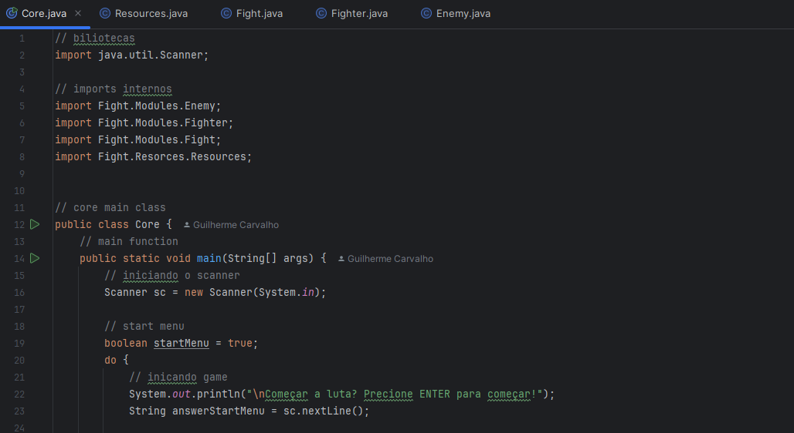

 

# figtht-Java

> Projeto em Java com foco em programação orientada a objetos. Simula uma luta livre entre personagens com diferentes tipos de golpes e um sistema de dano baseado em atributos. O jogador pode escolher entre 3 personagens disponíveis, enquanto os oponentes são selecionados aleatoriamente entre outros 3 lutadores.

## Tecnologias

## Contribuir

1. **Clonar projeto:**: `git clone https://github.com/guicarbar/fight-java.git`
2. **Criar feature/branch:**: `git checkout -b feature/Nome-da-branch`

## Licença

Este projeto está sob a licença [MIT](LICENSE) License. 
